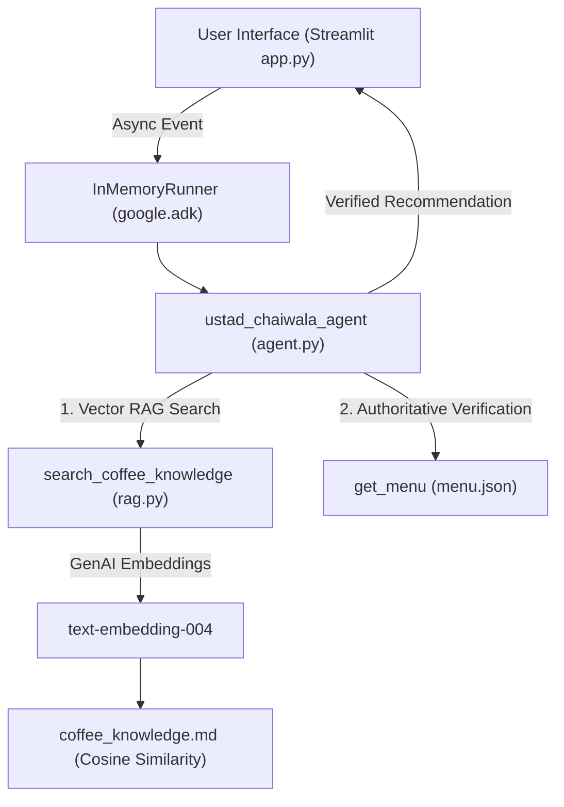

# ☕🫖 Desi Coffee & Chai Khana (Ustad Chaiwala Persona)

An authentic Indian Coffee & Chai House AI Assistant powered by **Ustad Chaiwala persona**, **Google Agent Development Kit (ADK)**, **Google GenAI**, and a custom **Vector RAG Architecture**.

---

## 🌟 Overview

**Desi Coffee & Chai Khana** is an authentic Indian beverage house guided by **Ustad Chaiwala** — helping guests discover coffee, chai, and specialty drinks based on their budget, temperature preferences (hot vs cold), strength (strong vs mild), sweetness levels, and strict allergen requirements (e.g., dairy/milk-free, nut-free).

### Key Features
* 🔍 **Vector RAG Engine**: Indexes rich beverage profiles in `coffee_knowledge.md` using Google's `text-embedding-004` model and NumPy cosine similarity.
* 🛡️ **Authoritative Safety**: `menu.json` remains the strict source of truth for pricing (₹), availability, and allergen disclosures.
* 🇮🇳 **Indian Cafe Menu**: Includes South Indian Filter Coffee, Desi Masala Chai, Kesar Badam Milk, Mango Iced Tea, Cold Brew, Espresso, Cappuccino, Iced Latte, Hot Chocolate, and Lemon Iced Tea.
* 🚫 **Allergen Protection**: Prevents recommending milk-containing items to customers with dairy allergies.
* 🎨 **Glassmorphic Streamlit UI**: Real-time menu matrix, dark warm coffee theme, quick suggestion chips, flavor matcher, RAG telemetry visualizer, and order builder.

---

## 🏗️ Architecture



---

## 📁 Project Structure

```
coffee-ai/
├── agent.py               # Google ADK agent definition & search tools
├── app.py                 # Streamlit chat interface & InMemoryRunner backend
├── rag.py                 # Vector RAG retrieval engine using Google GenAI & NumPy
├── coffee_knowledge.md    # Coffee & chai knowledge base chunks
├── menu.json              # Source of truth for menu items, prices, tags, and allergens
├── requirements.txt       # Project dependencies (google-adk, streamlit, google-genai, numpy)
├── Dockerfile             # Production Docker container definition for Cloud Run
└── README.md              # Project documentation
```

---

## 🚀 Quick Start

### 1. Prerequisites
Python 3.10+ installed.

### 2. Installation
```bash
# Clone repository
git clone https://github.com/Arju1234n/coffee-ai.git
cd coffee-ai

# Install dependencies
pip install -r requirements.txt
```

### 3. API Key Setup / Vertex AI Authentication
Set your Gemini API key in your terminal:
```bash
export GEMINI_API_KEY="your-gemini-api-key-here"
```
*(Alternatively, for Google Cloud Run deployments, set `GOOGLE_GENAI_USE_VERTEXAI=true` to authenticate seamlessly via Service Account Application Default Credentials).*

### 4. Run Locally
```bash
streamlit run app.py
```

The web app will launch at `http://localhost:8501`.

---

## ☁️ Google Cloud Run Deployment

Deploy seamlessly to Google Cloud Run:

```bash
# Set GCP project
gcloud config set project YOUR_PROJECT_ID

# Deploy directly from source
gcloud run deploy desi-coffee-ai \
  --source . \
  --region us-central1 \
  --allow-unauthenticated \
  --set-env-vars GOOGLE_GENAI_USE_VERTEXAI=true,GOOGLE_CLOUD_PROJECT=YOUR_PROJECT_ID
```

The container automatically listens on the environment `$PORT` (default 8080) and binds to `0.0.0.0`.

---

## 🔒 Security Best Practices

- **Zero Hardcoded Keys**: No API keys or secrets are stored in source code, Dockerfile, or GitHub.
- **Vertex AI Service Identity**: Production deployments on Cloud Run authenticate via IAM and Application Default Credentials (ADC).
- **Git Protection**: Sensitive environment files (`.env`, `.env.local`) and build artifacts are excluded via `.gitignore`.

---

## 🧪 Core Test Scenarios

1. **South Indian Filter Coffee**: `"Tell me about South Indian Filter Coffee price and ingredients."` → **₹140** (Brass filter, contains milk).
2. **Cold Milk-Free <₹250**: `"I want a cold strong coffee under ₹250 and I am allergic to milk."` → **Cold Brew** (₹220).
3. **Unavailable Product**: `"Do you have Matcha Frappuccino?"` → Clearly states unavailable; does NOT invent item/price.
4. **Hot Sweet Drink**: `"I want a hot sweet drink."` → **Hot Chocolate** (₹190) or **Kesar Badam Milk** (₹210).
5. **Milk & Nut Allergies**: `"I am allergic to milk and nuts."` → Recommends **Cold Brew** (₹220), **Espresso** (₹120), **Lemon Iced Tea** (₹150), **Mango Iced Tea** (₹180).
6. **Budget Limit <₹150**: `"Show me something under ₹150."` → Recommends **Espresso** (₹120), **Desi Masala Chai** (₹130), **Filter Coffee** (₹140), **Lemon Iced Tea** (₹150).

---

## 📜 License
MIT License