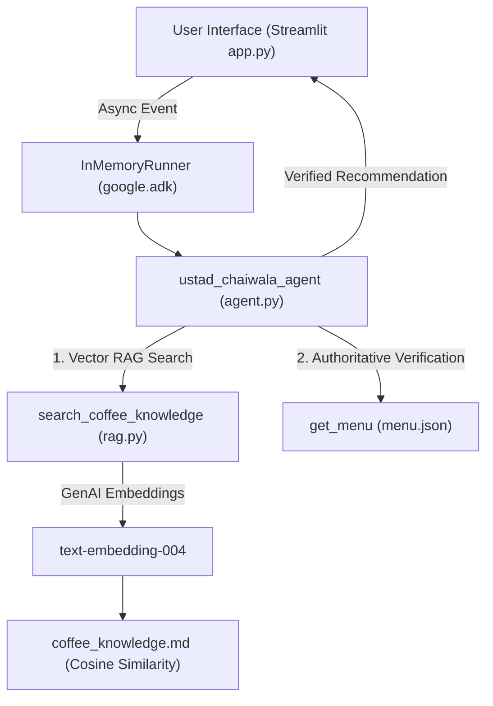

# ☕🫖 Desi Coffee & Chai Khana (Ustad Chaiwala Persona)

An authentic Indian Coffee & Chai House AI Assistant powered by **Ustad Chaiwala persona**, **Google Agent Development Kit (ADK)**, **Google GenAI**, and a custom **Vector RAG Architecture**.

---

## 🌟 Overview

**Desi Coffee & Chai Khana** is an authentic Indian beverage house guided by **Ustad Chaiwala** — helping guests discover coffee, chai, and specialty drinks based on their budget, temperature preferences (hot vs cold), strength (strong vs mild), sweetness levels, and strict allergen requirements (e.g., dairy/milk-free, nut-free).

### Key Features
* 🔍 **Vector RAG Engine**: Indexes rich beverage profiles in `coffee_knowledge.md` using Google's `text-embedding-004` model and NumPy cosine similarity.
* 🛡️ **Authoritative Safety**: `menu.json` remains the strict source of truth for pricing (₹), availability, and allergen disclosures.
* 🇮🇳 **Indian Cafe Menu**: Includes South Indian Filter Coffee, Desi Masala Chai, Kesar Badam Milk, Mango Iced Tea, Cold Brew, Espresso, Cappuccino, Iced Latte, Hot Chocolate, and Lemon Iced Tea.
* 🚫 **Allergen Protection**: Prevents recommending milk-containing items to customers with dairy allergies.
* 🎨 **Glassmorphic Streamlit UI**: Real-time menu matrix, dark warm coffee theme, quick suggestion chips, flavor matcher, RAG telemetry visualizer, and order builder.

---

## 🏗️ Architecture



---

## 📁 Project Structure

```
coffee-ai/
├── agent.py               # Google ADK agent definition & search tools
├── app.py                 # Streamlit chat interface & InMemoryRunner backend
├── rag.py                 # Vector RAG retrieval engine using Google GenAI & NumPy
├── coffee_knowledge.md    # Coffee & chai knowledge base chunks
├── menu.json              # Source of truth for menu items, prices, tags, and allergens
├── requirements.txt       # Project dependencies (google-adk, streamlit, google-genai, numpy)
└── README.md              # Project documentation
```

---

## 🚀 Quick Start

### 1. Prerequisites
Python 3.10+ installed.

### 2. Installation
```bash
# Clone repository
git clone https://github.com/Arju1234n/coffee-ai.git
cd coffee-ai

# Install dependencies
pip install -r requirements.txt
```

### 3. API Key Setup
Set your Gemini API key in your terminal:
```bash
export GEMINI_API_KEY="your-gemini-api-key-here"
```
*(Alternatively, you can enter your API key directly in the app's sidebar UI setting).*

### 4. Run Locally
```bash
streamlit run app.py
```

The web app will launch at `http://localhost:8501`.

---

## 🧪 Example Queries

* **Milk Allergy Query**: `"I want a cold strong coffee under ₹250 and I am allergic to milk."`  
  * **Result**: Recommends **Cold Brew** (₹220). Excludes `Iced Latte` (contains milk).
* **Traditional Indian Chai**: `"I want a warm spiced Indian tea with milk."`  
  * **Result**: Recommends **Desi Masala Chai** (₹130).
* **Unavailability Check**: `"Do you have Matcha Frappuccino?"`  
  * **Result**: Clearly states Matcha Frappuccino is unavailable and suggests available alternatives.

---

## 📜 License
MIT License